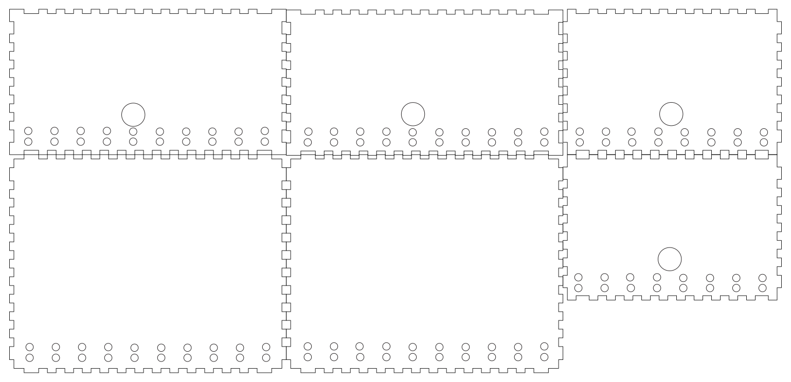

# Asked! game
Game developed with Arduino, it consists of asking questions, and players must answer.

## Description 
It was a project carried out for the course Problem Solving using Applied Computer Sciences, as a possible solution to attract customers to the "Master Wings" food place.

## Background
An analysis of the client was carried out applying Design Thinking to understand the problem, make a proposal, validate our prototype, etc.

A solution-focused on Physical Computing was proposed.

## Asked! game

### Components
      
- Breadboard
- Arduino Uno
- Arduino Keypad 4x4 
- Push Button Module (4)
- Arduino Display LCD 16x2
- USB 2.0 CABLE TYPE A/B
- Male and female jumpers
- LEDs of different colors (3)
- 330 ohms resistors
- Wood (for the box)

### Box design

## Contributors
- [Kelly Castro](https://github.com/kellycastrof)
- [Carlos Carvajal](https://github.com/cxcarvaj)

